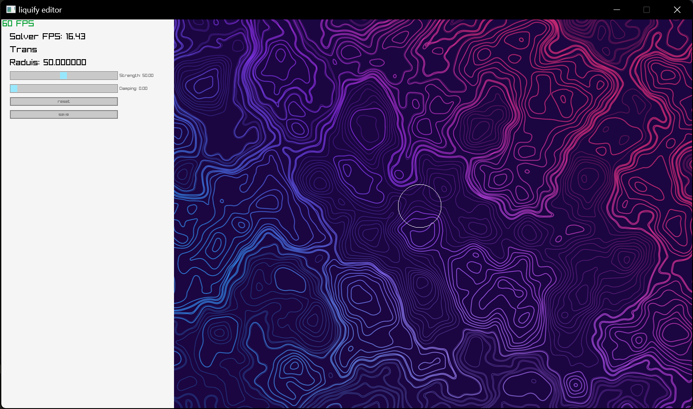
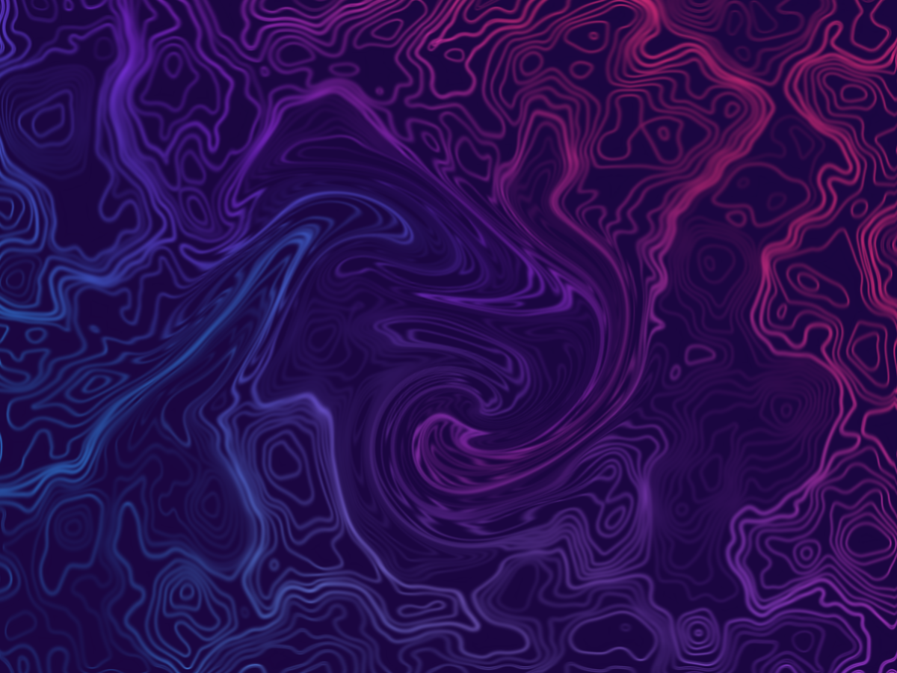
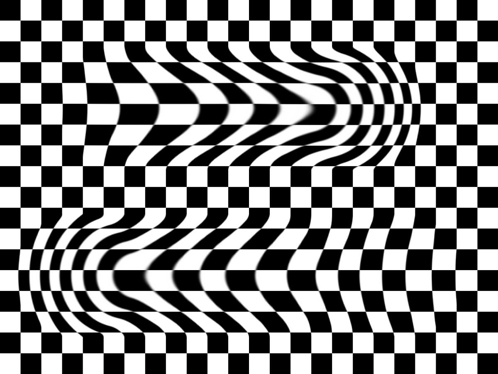
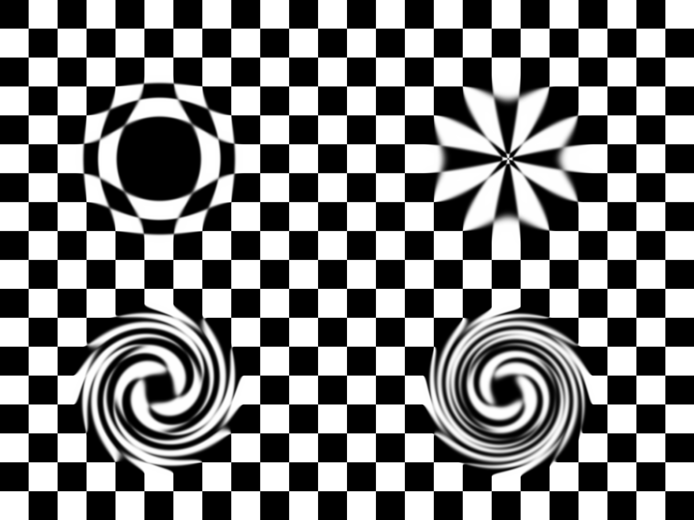

# Liquify Editor

This is an experimental repository for testing image warping algorithms and interactive fluid simulation.

## Configuration

This project is built with xmake ([xmake](https://xmake.io/)). The project is developed with the MSVC compiler of Visual Studio 2019 on Windows 11, although it may also be compatible with other platforms. MacBook with M1 is tested.

You can follow the [offcial tutorial](https://xmake.io/#/guide/installation) to install xmake. After that, navigate to the `LiquifyEditor` directory and run `xmake`. This will automatically install the required package dependencies and compile the project. If you encounter any network problems, I recommend using a proxy. For example, you can set the proxy in Windows PowerShell using the command `$Env:http_proxy="http://127.0.0.1:7890";$Env:https_proxy="http://127.0.0.1:7890"`.

### Compilation

```powershell
xmake
```

### Run

```powershell
xmake run
```



### Operations

- `left mouse`: brush.
- `middle mouse`: slide to adjust brush radius.
- `right mouse`: click to change brush behaviors.
  - `Trans` (Translation)
  - `ScalingUp`
  - `ScalingDown`
  - `RotationR`
  - `RotationL`

## Options

The editor provide severial options specified by `config.yaml`.

- editor `type`
  - `classic`: Traditional image warping mode.
  - `euler`: The image is mapped into the color field of a basic Euler grid fluid simulator. The velocity field is controlled by image warping motheds. `Scaling` and `Rotation` seem to fail without modifications (though you can still have a try).
- image `level`
  - The image is resized to `(12, 9) x level`. This display image size is `1200 x 900`, i.e. `level = 100`.
- simulation `levelsim`
  - The grid resolution of fluid velocity field is `(12, 9) x levelsim`. Since you want to play it in real time, it's lower than image resolution.
- `parallel_advection`
  - Whether to use multiple CPU cores to accelerate simulation.
  - On my Ryzen 9 5900HX laptop, `levelsim = 15` runs 10 simulation FPS by `false` and 18 simulation FPS by `true`.
- `image`
  - `blocks`: default image of a black and white checkerboard.
  - Your image path: now only `.png` pictures are supported.
    - Convert with `python convert.py -i img_path`
- `image_resize_type`
  - Images are scaled equally on two axises.
  - `fullscreen`: the `1200 x 900` screen is filled.
  - `fullimage`: the image stays complete.
- `output`
  - Image saving path.

## Screenshots




<br>


<br>






